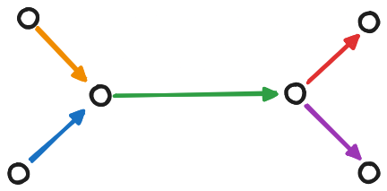

nigiri is a very memory efficient and fast public transport routing core.

## Data Structures

- We make heavy use of data-oriented programming in order to keep data compact
  and data access (cache) local.
- Everything is referenced by strong type aliases, aka `cista::strong<T, Tag>`.
  For example `trip_idx_t = cista::strong<std::uint32_t, struct _trip_idx>`.
  This means that we cannot mistake indices of different types.
  Most of those aliases are defined in `nigiri/types.h`. Some aliases that are
  only relevant locally are defined in different places.
- We make heavy use of `cista` data structures. This has different reasons.
  The main reason is that they can be serialized into a very compact binary
  image that does not require any de-serialization (just some pointers are
  translated from offsets).
- Frequently used data structures:
  - `vector_map<Idx, T>`: a normal vector that restricts access to a specific
    strong index type to prevent accidental bad accesses.
  - `vecvec<Idx, T>`: a more compact way to store `vector_map<Idx, vector<T>>`
    with the restriction that new inner vectors should only be pushed at the end.
    Pushing elements on "not the last inner vector" is possible but slow.
  - `paged_vecvec<Idx, T>`: like `vecvec<Idx, T>` but push is fast everywhere
    due to internal memory management using pages
  - `mm_vecvec` or `mm_paged_vecvec`: same as `vecvec` or `paged_vecvec` with
    the difference that the data is stored in
    [memory mapped files](https://en.wikipedia.org/wiki/Memory-mapped_file).

## Key Concepts

- Internal data structures use a neutral timezone (similar to Unix time).
- **`trip_idx_t`**: a trip is used to communicate with the outside world.
  Trips come from static timetable data which is usually given in some kind of
  local time (e.g. for GTFS: convert using offset at noon of the respective
  service date). Trips are also referenced in real-time updates via
  GTFS-RT or SIRI.
- **`transport_idx_t`**: Since we want to have everything in UTC, trips from
  timetable data have to be converted to UTC which can yield an arbitrary number
  of *transports*. For example a "normal" trip in a timezone with daylight saving
  time will be split into a winter and a summer version. If the trip goes over
  midnight, it can have even more versions on the switching days between winter
  and summer time. For each `transport_idx_t`, we store as timetable:
  - a `bitfield_idx_t` referencing a bitfield where each bit gives the information
    about whether or not the transport operates on a given day. The first bit/day
    is `timetable.internal_interval_days().from_`.
  - a series of (departure, arrival, departure, arrival, ...) times given relative
    to the service day from the bitfield.
- **`route_idx_t`**: A route groups transports based on their stop sequence and
  other factors that are relevant for routing. This grouping is required by the
  most modern routing algorithms as an optimization: the routing algorithm will
  only look at the first departure of each route. This is sufficient because the
  grouping of transports into routes is done in a way that a later departure on
  the same route cannot yield a better journey. This way, all later departures
  can be discarded. Note that this also means that optimizing a new criterion
  such as occupancy or CO2  will require a change of the route definition in
  order for the routing to guarantee correctness.

## Stay seated

Formats like GTFS and NeTEx can model stay-seated transfers. This means that
the trip changes but the passenger might not even notice. To model this, and
make sure that the routing does not count a transfer in this case, we concatenate
all stay seated trips into one transport.

In the following example, we have five trips. The left two trips are joined into
a middle trip which then splits again into two separate trips.

The preprocessing first transforms each trip into transports by converting
local times into UTC. After that from each entry point a depth first search
finds all ways a passenger could travel.

This means that a transport can contain several trips (as well a trip will
usually result in several transports!).